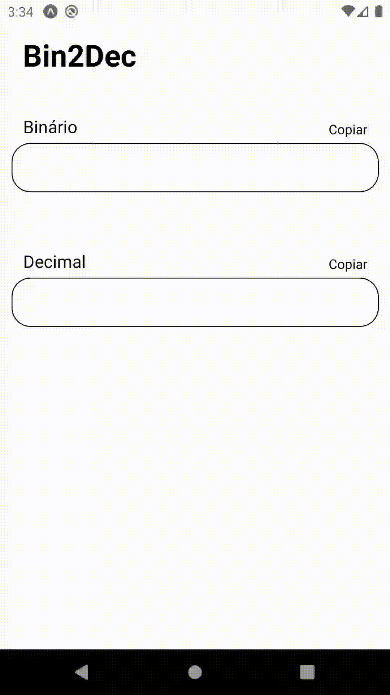
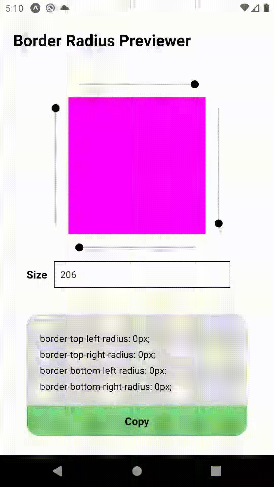
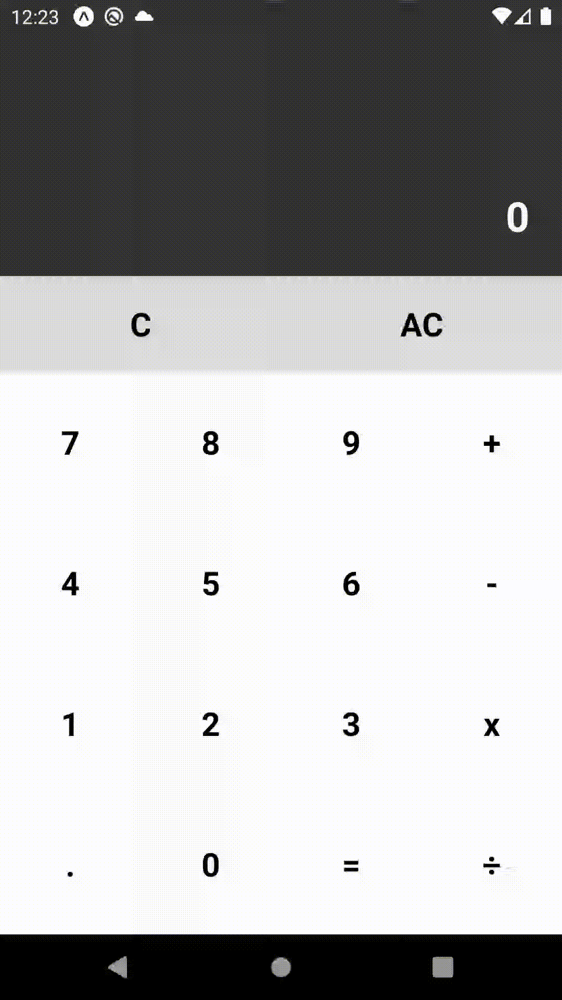
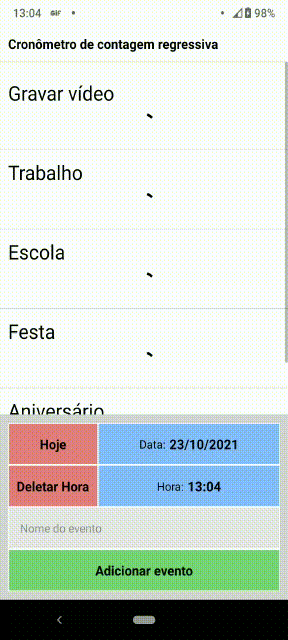
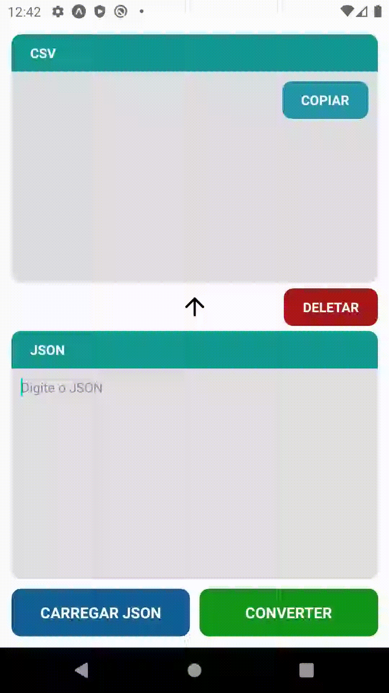

# Desafio App diario React Native
Desafio de 88 dias onde estou criando 1 aplicativo todos os dias.

## Dia 1: Bin2Dec
O primeiro desafio é o Bin2Dec, um aplicativo que converte um número binário para decimal.  
[Link do Repositório](https://github.com/VictorBorzaquel/Bin2Dec)  

## Dia 2: Border Radius Previewer
Aplicativo para ver e copiar a propriedade border-radius do Styled Components.  
[Link do Repositório](https://github.com/VictorBorzaquel/BorderRadiusPreviewer)  

## Dia 3: Calculator
Hoje desenvolvi uma calculadora utilizando a formatação em I18n.  
[Link do Repositório](https://github.com/VictorBorzaquel/Calculator)  

## Dia 4: Christmas Lights
Criei um aplicativo para simular as luzes do natal, utilizei o Reanimated para fazer a animação da luz apagando e acendendo e também utilizei o Slider para poder mudar a velocidade que a luz pisca e também mudar a quantidade de luzes.  
[Link do Repositório](https://github.com/VictorBorzaquel/ChristmasLights)  

## Dia 5: Cause Effect
Hoje criei um modal para selecionar um item de uma lista.  
Nesse caso o modal é utilizado para visualizar as informações do perfil selecionado.  
Utilizei a API ui-avatars, para criar a foto de perfil conforme as iniciais do primeiro e ultimo nome de cada usuário.  
[Link do Repositório](https://github.com/VictorBorzaquel/CauseEffect/blob/main/README.md)  

## Dia 6: Color Cycle
Fiz um aplicativo para ajudar quem está começando a trabalhar com UI / UX design a entender melhor as cores RGB.  
O aplicativo faz pequenas alterações nas cores para o usuário poder ver qual é a diferença que a mudança de cada cor faz, além de ver cores parecidas para usar na criação de interfaces.  
Para utilizar o aplicativo, basta colocar a intensidade de Vermelho, Verde e Azul, e também colocar a velocidade da mudança de cada cor.  
[Link do Repositório](https://github.com/VictorBorzaquel/ColorCycle)  

## Dia 7: Countdown Timer
Hoje fiz um aplicativo de cronômetro para eventos importantes, você pode cadastrar todas as datas dos eventos, o aplicativo armazena as datas no storage local do dispositivo e quando o cronometro termina, te avisa que está na hora do evento.  
[Link do Repositório](https://github.com/VictorBorzaquel/CountdownTimer)  

## Dia 8: JSON 2 CSV
Às vezes é preciso transformar uma lista de dados de um objeto em uma planilha.  
Criei um aplicativo que transforma o JSON (JavaScript Object) em um CSV (Planilha). O aplicativo tem as funções de digitar ou fazer o upload do JSON, e transforma em CSV.  
Nessa projeto aprendi sobre, leitura e escrita de arquivos, permissões do aplicativo, extensão de arquivo MIME Type e diretórios do android.  
[Link do Repositório](https://github.com/VictorBorzaquel/JSON2CSV)  

